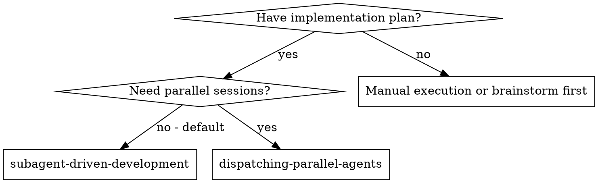
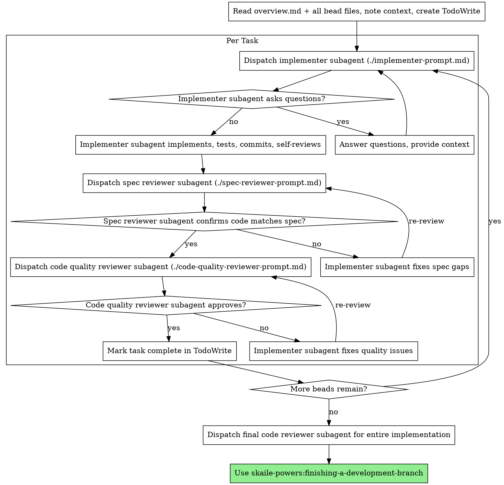

> Read `skaile-powers/references/config.md` before proceeding.

# Subagent-Driven Development

Execute a plan by dispatching a fresh subagent per **bead** (task file), with two-stage review after each: spec compliance review first, then code quality review.

**Why subagents:** You delegate beads to specialized agents with isolated context. By precisely crafting their instructions and context, you ensure they stay focused and succeed. They should never inherit your session's context or history — you construct exactly what they need. This also preserves your own context for coordination work.

**Core principle:** Fresh subagent per bead + two-stage review (spec then quality) = high quality, fast iteration

## Bead Execution

A plan is a directory of **beads** — one task file per vertical slice — plus an `overview.md` (see `writing-plans` and `config.md`). Drive execution off the beads, not a monolithic plan file:

1. **Read `overview.md`** to get the bead list and dependency graph. Create a TodoWrite entry per bead.
2. **Pick a ready bead** — one whose `status` is `pending` and whose every `depends_on` bead is `done`. Never start a bead with unmet dependencies.
3. **Read that bead file**, set its frontmatter `status: in-progress`, and dispatch the implementer subagent with the bead's full text + scene-setting context.
4. **On completion** (both reviews ✅): set the bead's frontmatter `status: done` and update its row in `overview.md`'s Status column.
5. **Follow-up work discovered mid-bead:** when a subagent surfaces necessary work outside the current bead's scope, do NOT expand the bead. Write a **new follow-up bead** — next free sub-number (`NNNN.M`), frontmatter `status: pending`, `depends_on` set honestly, a note that it was discovered during implementation — and link it into `overview.md`. Decide whether it blocks the current run or is deferred.
6. Repeat until every bead is `done`.

**HITL beads** (frontmatter `type: HITL`) need the user — pause and hand off rather than dispatching a subagent.

## When to Use



`subagent-driven-development` is the **default** execution mode. Use `dispatching-parallel-agents` only when beads are genuinely independent and you want true parallelism across separate sessions.

## The Process



## Model Selection

Use the least powerful model that can handle each role to conserve cost and increase speed.

**Mechanical implementation tasks** (isolated functions, clear specs, 1-2 files): use a fast, cheap model. Most implementation tasks are mechanical when the plan is well-specified.

**Integration and judgment tasks** (multi-file coordination, pattern matching, debugging): use a standard model.

**Architecture, design, and review tasks**: use the most capable available model.

**Task complexity signals:**
- Touches 1-2 files with a complete spec → cheap model
- Touches multiple files with integration concerns → standard model
- Requires design judgment or broad codebase understanding → most capable model

## Handling Implementer Status

Implementer subagents report one of four statuses. Handle each appropriately:

**DONE:** Proceed to spec compliance review.

**DONE_WITH_CONCERNS:** The implementer completed the work but flagged doubts. Read the concerns before proceeding. If the concerns are about correctness or scope, address them before review. If they're observations (e.g., "this file is getting large"), note them and proceed to review.

**NEEDS_CONTEXT:** The implementer needs information that wasn't provided. Provide the missing context and re-dispatch.

**BLOCKED:** The implementer cannot complete the task. Assess the blocker:
1. If it's a context problem, provide more context and re-dispatch with the same model
2. If the task requires more reasoning, re-dispatch with a more capable model
3. If the task is too large, break it into smaller pieces
4. If the plan itself is wrong, escalate to the human

**Never** ignore an escalation or force the same model to retry without changes. If the implementer said it's stuck, something needs to change.

## Prompt Templates

- `./implementer-prompt.md` - Dispatch implementer subagent
- `./spec-reviewer-prompt.md` - Dispatch spec compliance reviewer subagent
- `./code-quality-reviewer-prompt.md` - Dispatch code quality reviewer subagent

## Example Workflow

```
You: I'm using Subagent-Driven Development to execute this plan.

[Read overview.md: <artifact-root>/plans/0007-hooks/overview.md]
[Read all 5 bead files; create TodoWrite, one entry per bead]

Bead 0007.1: Hook installation script

[Pick 0007.1 — pending, no unmet depends_on]
[Set 0007.1 frontmatter status: in-progress]
[Dispatch implementation subagent with the full bead text + context]

Implementer: "Before I begin - should the hook be installed at user or system level?"

You: "User level (~/.config/superpowers/hooks/)"

Implementer: "Got it. Implementing now..."
[Later] Implementer:
  - Implemented install-hook command
  - Added tests, 5/5 passing
  - Self-review: Found I missed --force flag, added it
  - Committed

[Dispatch spec compliance reviewer]
Spec reviewer: ✅ Spec compliant - all requirements met, nothing extra

[Get git SHAs, dispatch code quality reviewer]
Code reviewer: Strengths: Good test coverage, clean. Issues: None. Approved.

[Set 0007.1 frontmatter status: done; update overview.md Status column]

Bead 0007.2: Recovery modes

[Pick 0007.2 — pending, depends_on 0007.1 which is now done]
[Set 0007.2 status: in-progress; dispatch implementer with full bead text + context]

Implementer: [No questions, proceeds]
Implementer:
  - Added verify/repair modes
  - 8/8 tests passing
  - Self-review: All good
  - Committed

[Dispatch spec compliance reviewer]
Spec reviewer: ❌ Issues:
  - Missing: Progress reporting (spec says "report every 100 items")
  - Extra: Added --json flag (not requested)

[Implementer fixes issues]
Implementer: Removed --json flag, added progress reporting

[Spec reviewer reviews again]
Spec reviewer: ✅ Spec compliant now

[Dispatch code quality reviewer]
Code reviewer: Strengths: Solid. Issues (Important): Magic number (100)

[Implementer fixes]
Implementer: Extracted PROGRESS_INTERVAL constant

[Code reviewer reviews again]
Code reviewer: ✅ Approved

[Set 0007.2 status: done; update overview.md]

...

[After all tasks]
[Dispatch final code-reviewer]
Final reviewer: All requirements met, ready to merge

Done!
```

## Advantages

**vs. Manual execution:**
- Subagents follow TDD naturally
- Fresh context per task (no confusion)
- Parallel-safe (subagents don't interfere)
- Subagent can ask questions (before AND during work)

**vs. Executing Plans:**
- Same session (no handoff)
- Continuous progress (no waiting)
- Review checkpoints automatic

**Efficiency gains:**
- No file reading overhead (controller provides full text)
- Controller curates exactly what context is needed
- Subagent gets complete information upfront
- Questions surfaced before work begins (not after)

**Quality gates:**
- Self-review catches issues before handoff
- Two-stage review: spec compliance, then code quality
- Review loops ensure fixes actually work
- Spec compliance prevents over/under-building
- Code quality ensures implementation is well-built

**Cost:**
- More subagent invocations (implementer + 2 reviewers per task)
- Controller does more prep work (extracting all tasks upfront)
- Review loops add iterations
- But catches issues early (cheaper than debugging later)

## Red Flags

**Never:**
- Start implementation on main/master branch without explicit user consent
- Skip reviews (spec compliance OR code quality)
- Proceed with unfixed issues
- Dispatch multiple implementation subagents in parallel (conflicts)
- Make subagent read plan file (provide full text instead)
- Skip scene-setting context (subagent needs to understand where task fits)
- Ignore subagent questions (answer before letting them proceed)
- Accept "close enough" on spec compliance (spec reviewer found issues = not done)
- Skip review loops (reviewer found issues = implementer fixes = review again)
- Let implementer self-review replace actual review (both are needed)
- **Start code quality review before spec compliance is ✅** (wrong order)
- Move to next task while either review has open issues

**If subagent asks questions:**
- Answer clearly and completely
- Provide additional context if needed
- Don't rush them into implementation

**If reviewer finds issues:**
- Implementer (same subagent) fixes them
- Reviewer reviews again
- Repeat until approved
- Don't skip the re-review

**If subagent fails task:**
- Dispatch fix subagent with specific instructions
- Don't try to fix manually (context pollution)

## Integration

**Required workflow skills:**
- **skaile-powers:using-git-worktrees** - REQUIRED: Set up isolated workspace before starting
- **skaile-powers:writing-plans** - Creates the plan this skill executes
- **skaile-powers:requesting-code-review** - Code review template for reviewer subagents
- **skaile-powers:finishing-a-development-branch** - Complete development after all tasks

**Subagents should use:**
- **skaile-powers:test-driven-development** - Subagents follow TDD for each bead

**Alternative workflow:**
- **skaile-powers:dispatching-parallel-agents** - For genuinely independent beads run across parallel sessions
